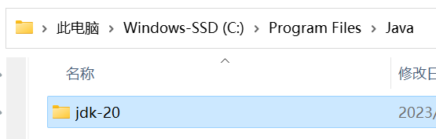
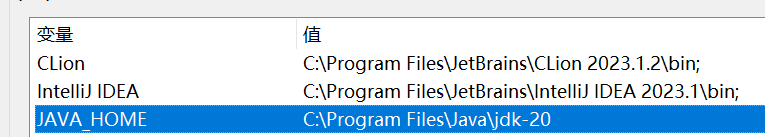
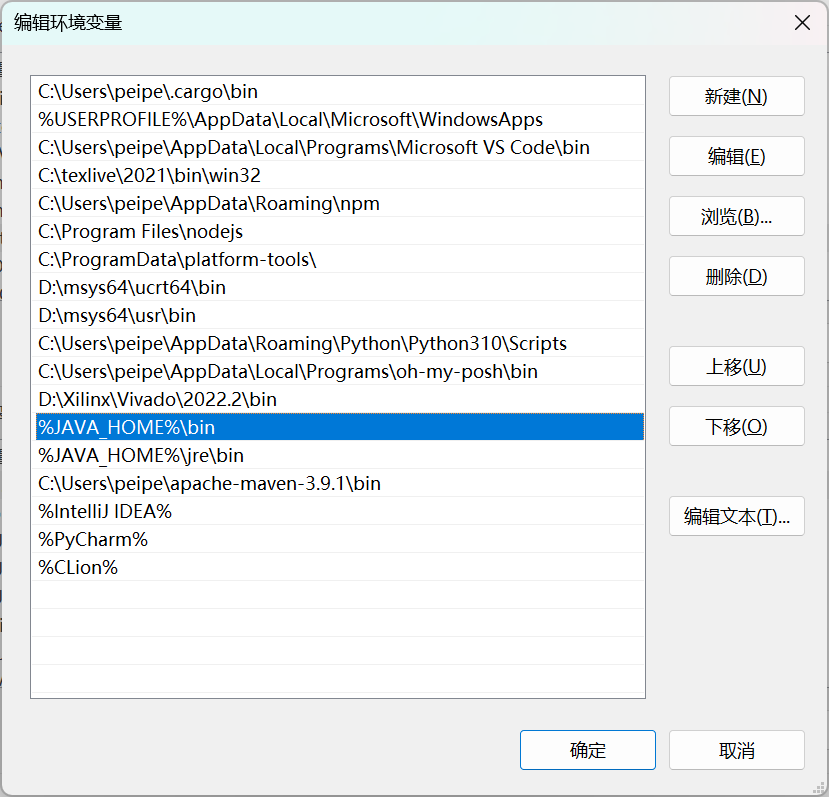
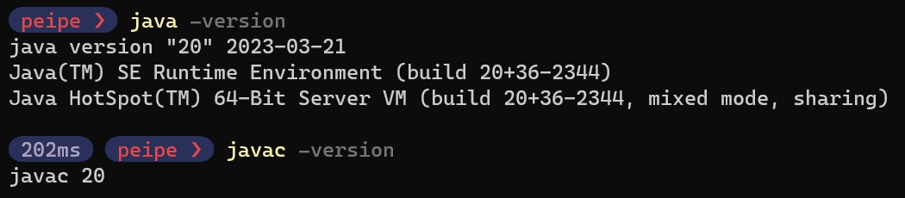
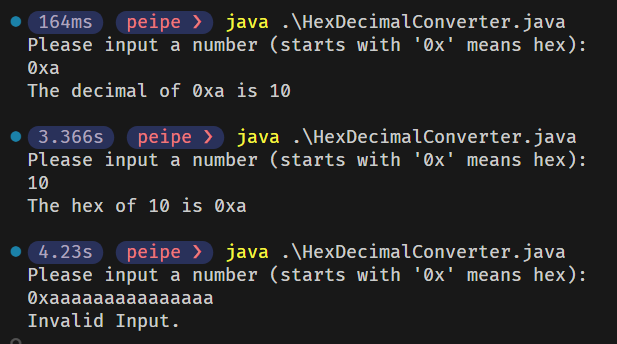

# Homework 1

## 安装Java JDK

### JDK 的下载和安装

从 https://jdk.java.net/ 选择一个版本的 JDK 进行下载，我选择的是 JDK 20 的版本。下载后解压到 `C:\Program Files\Java\jdk-20`。



### 配置环境变量

新建环境变量，名为 `JAVA_HOME`，值为 `C:\Program Files\Java\jdk-20`。



编辑环境变量 `Path`，添加 `%JAVA_HOME%\bin`。



### 验证安装

在命令行中输入 `java -version` 和 `javac -version`，能够正确显示版本号，说明安装成功。



## 安装 VSCode

### VSCode 的下载和安装

从 https://code.visualstudio.com/ 下载 VSCode 的安装包，安装到默认位置。

### 安装 Extension Pack for Java

在 VSCode 中搜索插件 `Extension Pack for Java`，安装成功后就可以在 VSCode 中编写 Java 代码了。


## 编写一个简单的 Java 程序

本次实验实现了一个简单的十六进制与十进制的转换程序。

当用户输入一个十六进制数时，程序将其转换为十进制数并输出；当用户输入一个十进制数时，程序将其转换为十六进制数并输出。其中，十六进制数以 `0x` 开头，而其他数则默认为十进制数。

### 代码

```java
import java.util.Scanner;

public class HexDecimalConverter {
    public static void main(String[] args) {

        Scanner scanner = new Scanner(System.in);

        System.out.println("Please input a number (starts with '0x' means hex):");
        String input = scanner.nextLine().trim();
        
        try {
            if (input.toLowerCase().startsWith("0x")) {
                System.out.println("The decimal of " + input + " is " + hexToDecimal(input.substring(2)));
            } else {
                System.out.println("The hex of " + input +  " is 0x" + decimalToHex(input));
            }
        } catch (Exception e) {
            System.out.println("Invalid Input.");
        }

        scanner.close();
    }

    public static String hexToDecimal(String hex) {
        return Integer.toString(Integer.parseInt(hex, 16));
    }

    public static String decimalToHex(String decimal) {
        return Integer.toHexString(Integer.parseInt(decimal));
    }

}
```

### 运行结果



